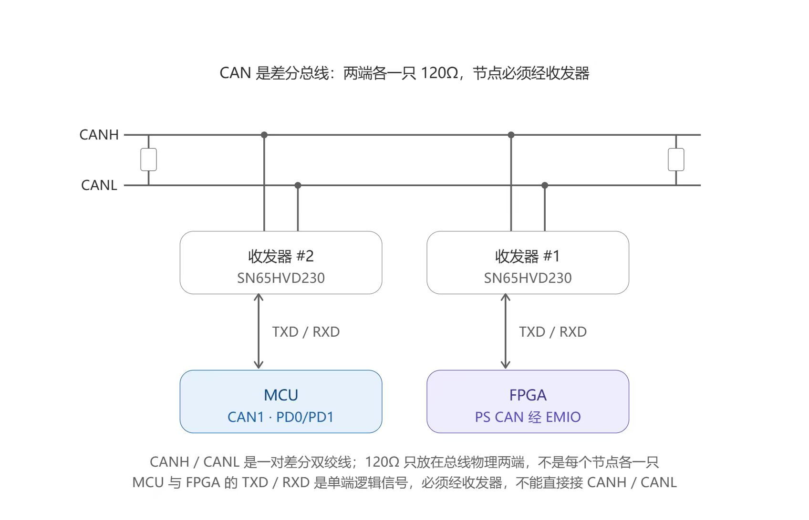
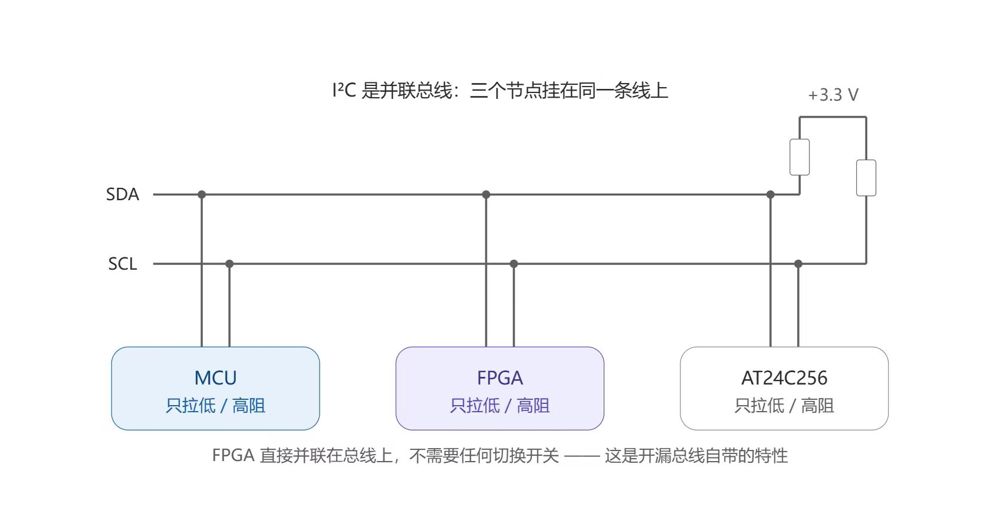
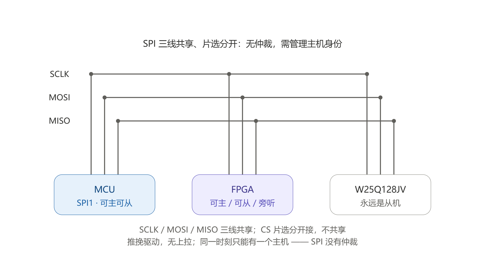
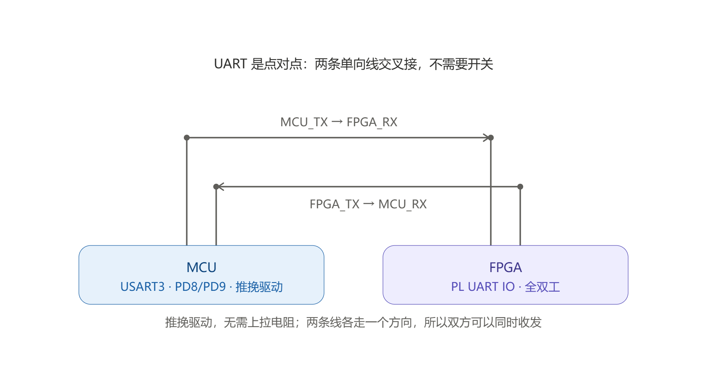

# 成员 C 实施规划：STM32F407 真值节点、Zynq PS 事件解析与系统验证

版本：v1.0
日期：2026-09-27
目标平台：立创·天空星 STM32F407VGT6 + Zynq-7020 多协议通信分析平台

## 1. 结论与执行边界

成员 C 本阶段交付分为两条互相校验的链路：

1. 成员 C 统一制定 SPI、UART、I²C、CAN 的协议规则、事件语义、异常判定、触发条件和黄金测试语料。
2. STM32F407 作为独立外部真值节点，按照成员 C 冻结的规则产生确定性测试流量，输出带 `case_id` 和 `transaction_id` 的日志。
3. Zynq PS 读取成员 A 已有的唯一事件快照链路，按照同一规则解析 128-bit 事件，在 LCD/串口/文件中展示并与 STM32 日志比对。

第一优先级仍是 SPI 被动监听闭环：

```text
STM32 主机 → W25Q128JV
      │真实 SPI 引脚并联旁听
      └──────────────→ FPGA PL SPI monitor

STM32 独立日志 ──┐
FPGA 统一事件 ───┼→ 成员 C 比对与报告
逻辑分析仪波形 ──┘
```

评审材料指定的正式工程 `D:\fpga_class\Multi_protocol` 当前不在本机，不能直接完成 BIT/HDF/ELF 合并。因此本交付包实现可单元测试的事件解析、快照访问、协议测试编排和 STM32 HAL 适配层；正式工程恢复后再按本文接口合入。

## 2. 本阶段范围

### 2.1 必须完成

- SPI1 Mode 0 发送 `9F 00 00 00` 读取 JEDEC ID；FPGA 被动解析，期望 ID 以实际装配器件为准（W25Q128JV 常见参考值为 `EF 40 18`，不能替代实物核对）。
- USART3 115200、8N1 与 FPGA 双向测试，USART1 独立输出真值日志。
- I2C1 对 AT24C256 做 16 字节写入、ACK polling、读回校验，FPGA 被动解析地址和 ACK/NACK。
- CAN1 经 SN65HVD230 与 Zynq 端收发器通信，先完成普通 11-bit ID 帧。
- PS 端解析既有 128-bit 事件 ABI，读取既有快照寄存器和 256 深度事件窗口。
- 每次测试保存测试条件、固件版本、事件数、缺失数、重复数和失败证据。

### 2.2 暂不承诺

- STM32 和 FPGA 在同一组 SPI 推挽线上同时作为主机。
- 无收发器直连 CANH/CANL。
- 用软件到达时间冒充 PL 硬件统一时间戳。
- 主动电气故障、总线短路、CAN 错误帧破坏等可能损伤硬件的测试。
- 在没有正式工程和 XDC 的情况下猜测 FPGA 封装管脚。

### 2.3 协议规则所有权与变更流程

所有协议规则由成员 C 独占制定和冻结，包括：

- 协议工作参数：SPI mode/位序、UART 波特率与帧格式、I²C 地址模式、CAN 位率与帧类型。
- 事件定义：`protocol_id`、`event_type`、方向、`flags_data`、数据长度和事务边界。
- 正常与异常判定：不完整字节、NACK、framing error、超时、截断和丢弃等。
- 触发规则：匹配字段、掩码、命中次数、优先级、前后保留数量。
- 测试规则：`case_id`、输入数据、预期事件序列、超时、重复次数和验收阈值。

唯一真源为 `docs/protocol-rules/protocol_rules.yaml`。执行流程固定为：

```text
成员 C 修改规则并提升 rules_version
→ A/B 评估实现影响，只能提出建议
→ 成员 C 冻结并记录 SHA-256
→ A 按版本实现 PL，B 按版本实现 STM32
→ C 用同版本验收事件、日志和 UI
```

成员 A/B 不得在 RTL 或固件中私自增加另一套判定；确需变更时先提交规则差异，由成员 C 决定是否合入。当前文件中的数值是 v1 初始基线，后续以成员 C 签字冻结的 YAML 为准。

## 3. 总体连接原则

所有连接先满足以下条件：

- STM32、Zynq、外设模块必须共地。
- 数字 IO 统一按 3.3 V 逻辑；接线前实测 Zynq IO Bank 电压。
- FPGA 第一阶段全部作为输入旁听，输出使能保持关闭。
- SPI/UART 是推挽信号；禁止两个输出直接相连。
- I²C 是开漏总线；只能主动拉低或释放，不能推挽输出高电平。
- CAN 控制器的 TXD/RXD 必须经过 CAN 收发器后才能接 CANH/CANL。
- 所有线尽量短，信号线旁边配地线；首次联调从低速开始。
- 真值日志 UART 与被测 UART 分离，避免日志本身改变被测数据流。

## 4. STM32 建议引脚表

以下复用已经按嘉立创天空星 STM32F407VGT6 高配版官方资料配置；外接模块供电、板载上拉和 CAN 终端仍需按到货实物复核。

| 链路 | STM32 引脚 | 方向 | FPGA/外设连接 | 初始参数 |
|---|---|---|---|---|
| SPI1 SCK | PA5 | 输出 | 板载 W25Q128 CLK + AC820 P7-1/U12 输入 | Mode 0，1.3125 MHz |
| SPI1 MISO | PA6 | 输入 | W25Q128 DO + AC820 P7-4/U9 输入 | MSB first |
| SPI1 MOSI | PA7 | 输出 | W25Q128 DI + AC820 P7-3/U10 输入 | MSB first |
| Flash CS | PA4 | 输出 | 板载 W25Q128 CS + AC820 P7-2/U11 输入 | 默认高 |
| I2C1 SCL | PB6 | 开漏双向 | AT24C256 SCL + FPGA_I2C_SCL | 100 kHz |
| I2C1 SDA | PB7 | 开漏双向 | AT24C256 SDA + FPGA_I2C_SDA | 100 kHz |
| USART3 TX | PD8 | 输出 | FPGA_UART_RX | 115200 8N1 |
| USART3 RX | PD9 | 输入 | FPGA_UART_TX | 115200 8N1 |
| CAN1 RX | PD0 | 输入 | STM32 侧 SN65HVD230 RXD | 500 kbit/s 起步 |
| CAN1 TX | PD1 | 输出 | STM32 侧 SN65HVD230 TXD | 500 kbit/s 起步 |
| 日志 USART1 TX | PA9 | 输出 | USB-UART/DAP-Link RX | 115200 或更高 |
| 日志 USART1 RX | PA10 | 输入 | USB-UART/DAP-Link TX | 可选命令输入 |
| TEST_SYNC | PC6 | 输出 | FPGA_SYNC 输入 | 每批测试前脉冲 |

`TEST_SYNC` 不是协议数据线，而是可选的跨设备时间标记。若板上没有合适空闲管脚，可先用固定测试顺序和事务内容关联，不能伪造同步精度。

## 5. CAN 连接与配合



### 5.1 接线

STM32 侧：

```text
PD1/CAN1_TX → SN65HVD230 D/TXD
PD0/CAN1_RX ← SN65HVD230 R/RXD
3.3 V        → SN65HVD230 VCC
GND          → SN65HVD230 GND
```

Zynq 侧：

```text
PS CAN 经 EMIO TX → 第二只 SN65HVD230 D/TXD
PS CAN 经 EMIO RX ← 第二只 SN65HVD230 R/RXD
```

两只收发器的 CANH 对 CANH、CANL 对 CANL，并共地。总线物理两端各放一只 120 Ω；如果两个节点就是总线两端，则每个模块启用一个终端。不能因为有两个节点再额外增加第三、第四个 120 Ω。

### 5.2 与 FPGA 端的配合

- 成员 A 确认 PS CAN0/CAN1 走 MIO 还是 EMIO，并给出 EMIO 对应 PL 管脚和 XDC。
- 成员 C 在 PS 使用 CAN 驱动收发帧，在 UI 中显示 ID、DLC、数据和错误状态。
- 仅由 PS 软件解析 CAN 时，事件时间是软件到达时间，不具备现有 PL 64-bit 时间戳精度。
- 若 CAN 要进入“统一硬件时间戳”正式功能，成员 A 需要把收发器 RXD 同时送入 PL 时间戳捕获模块，或者增加 PS→PL 标准事件桥；在此之前 CAN 标记为扩展功能。
- SN65HVD230 的 `Rs`/standby 配置以所购模块原理图为准；无法确认时不直接上总线。

### 5.3 首轮用例

- STM32 发送标准帧 ID `0x321`、DLC 8、递增数据。
- Zynq 收到后原样回发，STM32 对 ID、DLC、8 字节逐项比较。
- 先做 10 次冒烟，再做 1000 次；记录超时、错误计数器和 bus-off。

## 6. I²C 连接与配合



### 6.1 接线

```text
PB6/I2C1_SCL ─┬─ AT24C256 SCL
              └─ FPGA_I2C_SCL

PB7/I2C1_SDA ─┬─ AT24C256 SDA
              └─ FPGA_I2C_SDA

GND ──────────── 三方共地
```

SCL、SDA 各保留一组到 3.3 V 的上拉，起步可用 4.7 kΩ。很多 EEPROM 模块已经带上拉，必须测量或查看模块原理图，避免多组并联导致等效阻值过小。AT24C256 的 A0/A1/A2 全接地时 7-bit 地址通常为 `0x50`；WP 接地才能写入。

### 6.2 FPGA 约束

- 被动监听阶段，FPGA SCL/SDA 都配置为输入，不驱动总线。
- 将来需要 ACK/NACK 或时钟拉伸测试时，FPGA 必须用开漏语义：输出数据恒为 0，通过 `IOBUF.T` 控制“拉低/释放”。
- 禁止 FPGA 推挽输出 1；禁止在未确认上拉和总线空闲时主动拉低。
- 事件至少覆盖 START、ADDRESS、R/W、DATA、ACK/NACK、STOP 和重复 START。

### 6.3 首轮用例

- 向 `0x50` 的 `0x0100` 地址写 16 字节固定种子数据。
- ACK polling 等待 EEPROM 内部写完成。
- 从相同地址读回并逐字节比对。
- 用不存在的 `0x51` 地址制造可重复 NACK，不需要破坏硬件。

## 7. SPI 连接与配合



### 7.1 对原图的工程修订

原图表达了 SPI 没有仲裁、必须管理主机身份，这是正确的；但第一阶段不能把 STM32 和 FPGA 都作为推挽主机直接并联到 SCLK/MOSI。推荐固定为：

```text
STM32：唯一主机，驱动 SCLK/MOSI/CS
W25Q128JV：唯一从机，驱动 MISO
FPGA：SCLK/MOSI/MISO/CS 四线全部只输入旁听
```

FPGA 必须同时采样 MCU 使用的 Flash CS。若 FPGA 使用另一根独立 CS，就无法准确知道 STM32→W25Q128 事务边界。

如后续需要 FPGA 主机或 FPGA Flash 模型，应使用物理跳线、总线开关或带 OE 的缓冲器切换角色；切换前所有推挽输出进入高阻，任何时刻只允许一个主机驱动 SCLK/MOSI。

### 7.2 接线

```text
PA5/SPI1_SCK  ─┬─ W25Q128 CLK
               └─ FPGA_SPI_SCLK（输入）
PA7/SPI1_MOSI ─┬─ W25Q128 DI
               └─ FPGA_SPI_MOSI（输入）
PA6/SPI1_MISO ─┬─ W25Q128 DO
               └─ FPGA_SPI_MISO（输入）
PA4/FLASH_CS  ─┬─ W25Q128 CS
               └─ FPGA_SPI_CS（输入）
GND ───────────── 三方共地
```

### 7.3 FPGA 事件期望

读取 JEDEC ID 时：

```text
START(txn=N)
DATA(MOSI=9F, MISO=xx)
DATA(MOSI=FF, MISO=EF)
DATA(MOSI=FF, MISO=40)
DATA(MOSI=FF, MISO=18)
END(txn=N)
```

SPI DATA 事件的 `flags_data[15:8]=MISO`、`flags_data[7:0]=MOSI`，`data_length=2`。事务编号由 FPGA 根据 CS 边界生成；STM32 日志使用自己的顺序号，通过固定用例和可选 `TEST_SYNC` 对齐，不强行假设两边编号相同。

### 7.4 安全的偶发故障

- `CS` 在完整字节之间提前拉高：验证事务提前结束。
- 板级专用 GPIO bit-bang 发 1～7 个时钟后释放 CS：验证 `INCOMPLETE_BYTE`。该功能只能在确认没有第二主机驱动时启用。
- 每第 N 次触发，或使用固定种子决定触发位置；日志必须保存 N/种子。
- 默认代码不启用危险 bit-bang 钩子，避免未确认管脚时误驱动总线。

## 8. UART 连接与配合



### 8.1 接线

```text
STM32 PD8 / USART3_TX → FPGA_UART_RX
STM32 PD9 / USART3_RX ← FPGA_UART_TX
STM32 GND              ↔ FPGA GND
```

UART 是推挽点对点连接，不需要上拉。双方都是 3.3 V CMOS 才能直连。真值日志必须通过另一路 USART1/USB-UART 输出，不能复用 USART3。

### 8.2 FPGA 配合

- 起步固定 115200、8N1，不做自动波特率。
- FPGA 若只监听 STM32 TX，可不驱动 `FPGA_UART_TX`。
- 做回环测试时，FPGA 收到 8 字节后原样回发；STM32 比较返回值。
- PL 事件包括 DATA 和 framing error；若 FPGA TX 尚未完成，先只做单向监听语料。

### 8.3 故障用例

- 固定发送 `00 FF 55 AA`、递增 8 字节、固定随机种子序列。
- 错误停止位需要临时 GPIO 精确定时，只有示波器确认位宽后才启用。
- 更安全的第一阶段错误是 FPGA 故意不回发或回发错误字节，由 STM32 报告超时/不一致。

## 9. 128-bit 事件 ABI 与 PS 配合

成员 C 负责制定事件 ABI 语义，但不建立第二套 FIFO 或第二套事件寄存器。成员 A 按成员 C 冻结的 ABI 实现 PL，PS 使用现有地址：

| 地址偏移 | 功能 |
|---:|---|
| `0x1000` | CAPTURE_CTRL |
| `0x1004` | CAPTURE_STATUS |
| `0x1008` | SNAPSHOT_ID |
| `0x100C` | SNAPSHOT_COUNT |
| `0x1010` | TRIGGER_INDEX |
| `0x1014` | DROPPED_COUNT |
| `0x1018` | VIRTUAL_EVENT |
| `0x6000～0x6FFF` | SNAPSHOT DATA WINDOW |

事件字段：

| 位段 | 含义 |
|---:|---|
| `[127:64]` | 64-bit PL 时间戳 |
| `[63:60]` | protocol_id：0 虚拟、1 UART、2 SPI、3 I²C、4 CAN |
| `[59:56]` | channel_id |
| `[55:54]` | direction |
| `[53:48]` | event_type：START=`0x00`、DATA=`0x01`、END=`0x02`、ERROR=`0x3F` |
| `[47:32]` | flags/data |
| `[31:24]` | 当前事件数据字节数 |
| `[23:0]` | FPGA 事务编号 |

仓库现有 `software/src/capture_demo.c` 负责快照寄存器访问和事件读取。成员 C 的 STM32 代码不复制第二套 Zynq PS 驱动；后续实时 SPI 页面直接扩展现有 PS 正式路径。

合入正式工程前，成员 A/C 必须用 `VIRTUAL_EVENT` 的 bit31 触发位和 bits23:0 事务号完成端到端自检，再用 SPI 仿真事件确认完整 128-bit word 顺序。当前正式窗口是低 32 位在低地址；不得绕过成员 C 修改 ABI 含义。

## 10. STM32 真值日志格式

每个事务输出一行 JSONL：

```json
{"seq":1,"ms":1250,"case":1001,"txn":1,"protocol":"SPI","op":"JEDEC_ID","dir":"TXRX","data":"00EF4018","result":0,"detail":"matched"}
```

字段说明：

- `seq`：日志记录顺序号。
- `case`：团队冻结的测试用例编号。
- `txn`：STM32 本地事务号，不等同于 FPGA 事务号。
- `data`：实际收发结果；不能只记期望值。
- `result=0` 表示本节点判定通过，负值表示参数、IO、超时或校验失败。
- 固件提交号、编译时间、板号、协议速率在每批日志头部额外记录。

## 11. 成员 A/B/C 交接清单

### 成员 A → C

- 正式 AXI 基地址、四字 word 顺序和状态位定义。
- SPI/UART/I²C PL 输入管脚与 IO Bank 电压。
- PL 对成员 C 规则版本的实现覆盖表和未实现项。
- 对应 BIT/HDF 的哈希与构建提交号。
- CAN 是否可以走 EMIO、是否提供 PL 起始位时间戳。

### 成员 C → A

- 唯一正式的 `docs/protocol-rules/protocol_rules.yaml`、版本号和 SHA-256。
- 各协议事件类型、flags、事务边界和触发条件最终表。
- 固定测试语料和预期事件序列。
- STM32 JSONL 原始日志。
- 每个失败事务的 `case_id`、本地顺序、数据和时间。
- 快照读取/ABI 单元测试结果。
- 缺失、重复、误解析统计，不只提交截图。

### 成员 B/C 硬件复核

- 天空星实际排针与板载复用。
- 外设模块型号、上拉、终端、地址脚和写保护。
- FPGA 与 STM32 地、电源和 IO 电压。
- 逻辑分析仪同时观察同一批事务。

## 12. 从 2026-09-27 开始的实施安排

| 日期 | 成员 C 工作 | 验收证据 |
|---|---|---|
| 9/27～9/28 | 成员 C 冻结连接表、事件 ABI 和协议规则 v1；编译并跑通单元测试 | 规则文件版本/哈希；`ctest` 全通过；接口评审记录 |
| 9/29～10/1 | CubeMX 建工程；SPI `0x9F`、独立 JSONL 日志 | 串口日志＋逻辑分析仪截图/原始文件 |
| 10/2～10/5 | 正式工程恢复后接入快照驱动；虚拟事件校验 word 顺序 | 虚拟事件从 PL→AXI→PS 闭环 |
| 10/6～10/10 | SPI 三方闭环和不完整事务触发 | 正常 1000 次、故障 100 次统计 |
| 10/11～10/16 | UART/I²C 最小闭环 | UART 1000 帧、I²C 正常与 NACK 记录 |
| 10/17～10/20 | CAN go/no-go；硬件完整才接 PS CAN | 普通帧 1000 次或书面降级决定 |
| 10/21～10/27 | 10000 次压力测试、2 小时连续运行、UI/报告收敛 | 缺失/重复/误解析、P50/P95、版本哈希 |
| 10/28～11/4 | 冻结功能，只修严重缺陷；视频、报告、备份产物 | 可重复演示包和提交包 |

## 13. 验收流程

每个测试都按同一流程执行：

```text
确认接线与角色 → 复位 STM32/Zynq/外设
→ 记录固件、BIT/HDF/ELF 哈希和参数
→ ARM FPGA 快照
→ STM32 输出 TEST_SYNC（若有）并执行 case
→ STM32 保存实际收发结果
→ FPGA 触发/冻结并由 PS 读取事件
→ 导出逻辑分析仪原始记录
→ 三方比较 → ACK 快照 → 恢复同一初态重跑
```

第一阶段目标：

- SPI JEDEC ID 正常事务 1000 次无缺失、重复和边界错误。
- SPI 指定异常 100 次都命中相同规则并保留前后事件。
- UART 115200、8N1 的 1000 个测试帧字节一致。
- I²C 地址、R/W、ACK/NACK 与 STM32 日志一致。
- CAN 只有硬件通路完整并明确时间戳边界后才计入正式指标。
- 任一缓冲截断、仲裁丢弃、日志超时都单列，不得计为通过。

## 14. 采购链接与核对要求

用户提供的动态商品链接保留为采购线索：

- [商品链接 1：天空星 STM32F407VGT6/相关 SKU](https://detail.tmall.com/item.htm?id=557404587025)
- [商品链接 2：相关外设模块 SKU](https://detail.tmall.com/item.htm?id=701438200081)
- [商品链接 3：相关外设模块 SKU](https://detail.tmall.com/item.htm?id=706584655034)

商品页内容可能随 SKU 变化，接线依据的优先级必须是：到货实物丝印与原理图 → 芯片官方数据手册 → 模块商家原理图 → 商品标题。不能仅凭商品图片确定上拉、终端电阻、地址脚或供电兼容性。

建议核对的官方器件资料：STM32F407VG 数据手册、W25Q128JV 数据手册、AT24C256 系列数据手册、SN65HVD230 数据手册，以及所用 Zynq 开发板的原理图/XDC。

## 15. 当前已实现代码

- 协议无关回调接口和可移植测试编排。
- SPI JEDEC ID、SPI 固定模式、UART 回环、I²C EEPROM 写读、CAN 回环用例。
- JSONL 真值日志。
- STM32F407 HAL 适配层。
- 成员 C 独占维护的协议规则唯一真源及规则变更流程。
- 与仓库正式 128-bit 事件 ABI 对齐的协议规则。
- STM32 日志与现有 Zynq 快照事件的对照流程。
- 电脑端 fake platform 单元测试。

已经完成 CubeMX 6.15.0、STM32CubeF4 v1.28.3 和 Keil MDK-ARM 完整工程，ARMCC 5.06 编译结果为 0 error、0 warning。尚需硬件后完成：天空星实板烧录、外接 AT24C256/SN65HVD230 联调、FPGA UART/CAN 回环、LCD 实时页面和三方实测。
